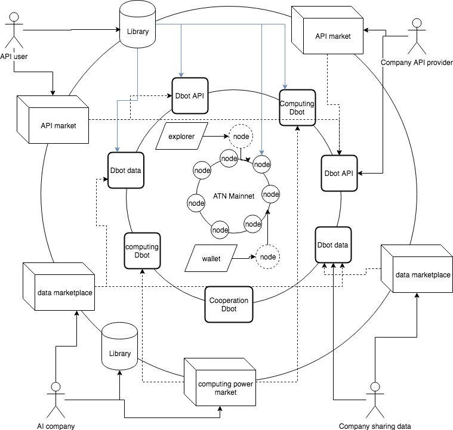
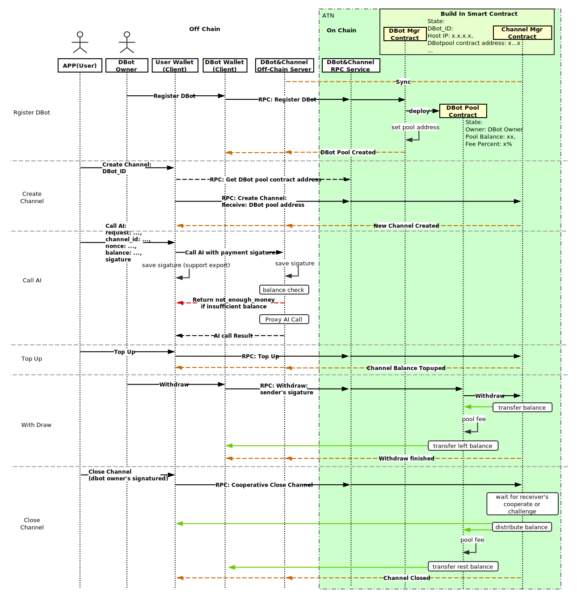
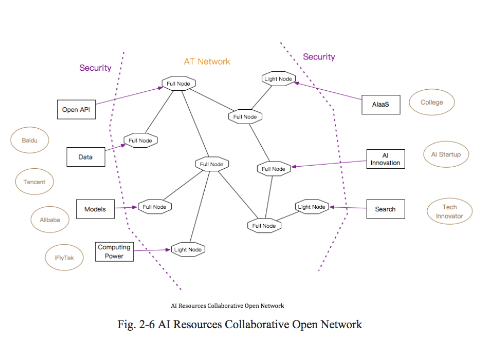
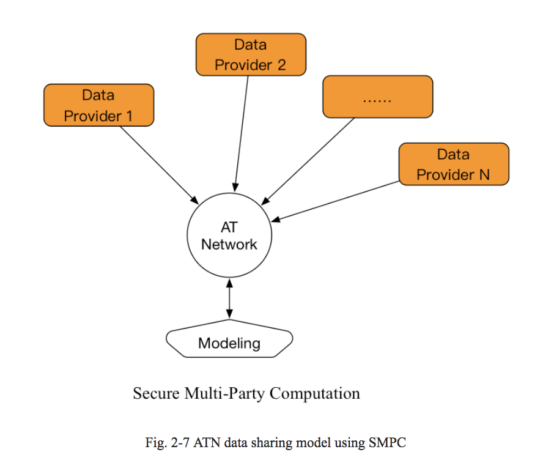
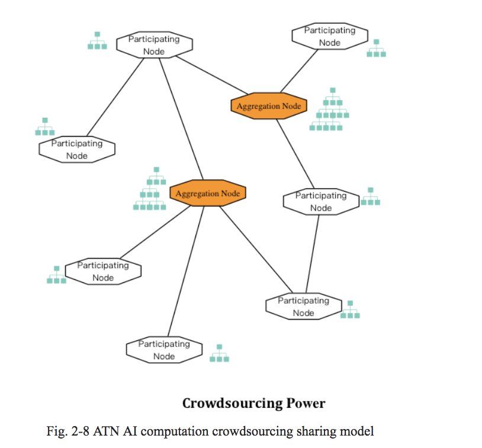

# ATN 技术白皮书
### 版本 0.3.3
## 摘要
区块链技术前景广阔的原因是目前非常多的行业存在垄断。人工智能就是这样一个领域，各大厂商相互割裂，基于目前人工智能的深度学习算法，每一个人工智能都是由大数据喂出来的一头怪兽，只有那些拥有大量数据的软件公司才能训练出更加强大的人工智能怪兽，因此，本来应该属于用户的数据却成为了互联网公司们争抢的最有价值的资源，但是因为每个公司的业务类型不同，拥有的数据也多种多样，所以每家公司即使再强大，也最多只能垄断一个领域的数据，而不能垄断所有的数据，因此每家公司陷入了尴尬的自给自足境地，因为无法也不愿意交换和共享自己最有价值的资源（也就是数据），导致各自陷入了孤岛和困境。

数据垄断带来的这些风险和问题，让区块链的去中心化有了用武之地，区块链最有价值的应用方法，就是协调各方面的问题：不同公司之间的协调，不同实体以及机构之间跨越疆界的协调，并以互信的方式进行充分互动，构建价值网络并相互交换价值，打破原先的垄断，在未来的人工智能网络中让不同的人工智能服务可以共建一个生态。

我们提出ATN的解决方案：一种去中心化的，无需授权的，用户自定义人工智能服务和使用接口的开放区块链平台。整体设计结合了Oracle，，以太坊等区块链项目的想法，侧重解决人工智能服务(AIaaS)与EVM兼容的智能合约之间互操作性的问题，未来计划利用下一代区块链技术为AIaaS搭建一个开放的经济系统，使得AI服务可以更多的交易和互操作，形成更强更丰富的人工智能。平台设计了AI服务接入方式，中间通过ATN智能合约进行连接并将接入的AI服务无需授权的提供给任何人，使得AI服务提供者和使用者都更加容易使用AI网络。

## 介绍
共享AI的第一步，是我们如何通过区块链建立一个将不同AI服务连接到一起的服务，以及如何搭建区块链智能合约世界和AI世界之间的桥梁，让用户获益。我们将介绍如何用DBot技术链下共识技术来让区块链的智能合约和AI服务互相操作，我们将首先在以太坊上实现一个Dapp来向以太坊网络上的合约开放这种能力。在这个阶段，还将提供一个ERC20的Token合约，提供代币作为使用这些AI服务的燃料(手续费)。ATN的第二步，就是搭建一条独立的基础链，并将代币互换服务、DBot平台等融合进一条独立的链中，利用侧链和分片技术与其他的网络进行交互并实现价值交换。代币合约将迁移至独立链中变成本地代币。

ATN可以解决智能合约中调用AI服务的问题。目前类似以太坊网络中的智能合约中的"智能"并不真正智能，"智能"的说法来自于"智能手机"，更倾向于自动化的意思，而ATN通过引入AI，可以让智能合约及区块链系统成为真正的"智能"。另外，由于目前类似以太坊网络中的这些Dapp生态，很多都是用智能合约实现并治理，当智能合约可以使用AI服务后，AI将会给智能合约赋能，并帮助类似Aragon这样的智能合约实现Dapp的人工智能治理。

ATN可以解决目前互相割裂的诸多AI服务之间相互调用的问题，因为ATN通过Dapp(或第二阶段的区块链系统)提供了一个去中心化的，无需授权，人人皆可访问的AI经济网络，解决AI参与方之间合作问题，ATN成为了AI生态的一个支付网络和具备智能合约能力的经济基础设施。

### 无需互信的AI互操作
与传统AI服务相比，系统更加易于实施。加入ATN网络非常简单：

- 基于ATN提供的API和Schema包装现有的人工智能服务
- 开发dbot的Oracle预言机程序，接入AI服务，并部署到ATN的多个预言机Relay服务器中.
- 开发调用AI服务的代理智能合约，定义价格和其他参数，并部署和注册到ATN的AI服务管理智能合约中。

ATN将对常规用户开放提供AI服务调用接口，对常规用户隐藏所有复杂的区块链技术，但对社区开源这些复杂的技术规范和实现。
### 统一的接口认证

目前主要的AI服务提供商接入都需要授权，例如通过安全签名的方式，对<app_key, app_secret>进行签名，而这里的<app_key, app_secret>通常由AI服务提供者分配给AI服务调用者用户。对于ATN来说，直接调用AI服务的就是DBot账户，但是由谁来最终调用AI服务通常是由系统选择或者投票竞选出来的，也就是说调用AI服务的DBot账户会动态变化，因此，在AI服务那里给哪些DBot账户分配访问令牌(Token)，以及如何正确的分配访问令牌(Token)变得困难。因此，在ATN中，提出一种统一的AI服务授权管理办法，需要AI服务提供者对该授权访问方式提供支持。

因为在ATN中，每一个DBot账户都会有一个对应的活跃<公钥，私钥>对，每一次调用AI服务时，DBot账户需要用私钥对调用请求内容或其hash做签名，而AI服务通过DBot对应的账户公钥验证该签名，同时还需要通过DBot平台提供的状态查询服务，查询改DBot账户是否是有效的被选举出来具有操作该AI服务权限的账户。为了避免重放攻击(Replay Attack)，请求里面应该包含一个nonce随机数值，并且相应请求的AI服务应该对请求做避免重复性的校验。

这种去中心化和无需许可的设计，为所有人提供了一个开放且安全的网络接入，并且解决了AI服务之间的复杂的合作和访问问题。ATN还将这种接口认证方式与支付通道技术相结合，在经济层面为API服务提供者和消费者提供了极大的便利。

###  开放平台
ATN是一个可通过智能合约扩展的开放平台，从而实现与其它基于以太坊的Dapps的交互和协作。 ATN的开源特性使得第三方开发人员能更好的在平台之上构建可交易应用程序。 该平台可以支持多种应用程序。

## 架构设计
### 总览

- API, 数据，和算力市场
- 丰富的开发者生态和多种形态的Dbots
- 可以接入ATN服务的各种开发者库包
- 支持以太坊虚拟机(EVM)的智能合约

### ATN代币标准
ATN代币为ATN网络的主要代币。ATN代币可以作为用户使用ATN区块链网络和AI服务的费用和燃料，也可以作为DBot账户提供约定服务的激励报酬和AI服务提供商的收入。ATN代币是ATN网络的通用代币。

ATN代币的经济激励系统将会作为ATN去中心化自治系统的重要部分参与网络的升级和管理。同时，代币经济系统也会给AI和机器人带来更充分的经济独立 。

ATN代币最终将基于不同的网络标准实现对应的标准代币，以EVM兼容的智能合约平台为例，将会遵循以太坊上提出的ERC-20和ERC223两个标准。

ERC20 代币标准描述了以太坊代币合约必须实现和遵循的方法和事件，标准化有利于帮助不同的功能和组件共享基础设施。

与大部分代币合约只支持ERC20标准不同，ATN代币合约还会支持ERC223标准 ，这是因为ERC223将会解决ERC20的诸多问题并带来一些好处：
1.	当代币转账的接收方是合约账户时，ERC-20是无法实现对这个转账交易的回调处理的，因此无法实现类似本地代币ETH那样的fallback功能。ERC223使得代币可以像本地代币那样，除了用于代币转账，还可以用于与各种合约交互，包括用于代币分发合约。
2.	代币有可能会被用于发送至那些对ERC20代币并不友好的合约，因为这些合约缺乏对代币良好的接收处理，大量的代币可能会因为这个缺陷而丢失。
3.	当账户需要某个合约来花费他的ERC20代币余额时，这个账户必须先对这个合约进行额度授信操作(approve)，然后合约才可以调用转账操作(transferFrom)来进行花费，并且，这样需要产生两笔网络交易，消耗更多的手续费和时间。而ERC223可以将这两个交易和操作合二为一，大大简化了这种场景的流程。

虽然ERC223是一个还在修订中的标准，且目前大部分钱包和基础设置还没有完全支持ERC223，但是因为其给代币模型带来的诸多优点，随着时间的推进，会有越来越多的钱包和基础设施支持这个标准，目前雷电网络项目已经支持ERC223。

## 服务提供者和消费者的交互
### AI和API市场

AI市场为消费者提供了诸多不同类别的服务。最新的测试版本已经可以在[这里](https://market-test.atnio.net/)访问体验，以及一个帮助快速上手的[演示视频](https://www.youtube.com/watch?v=gsxSz9jfMd8)。

API市场是一个开放的市场平台，会为市场中注册的DBot自动生成相应的API描述页。任何人都可以在这个API市场里部署自己的市场，即“摊位”，并且这样的自由部署的子市场可以是完全开放，即任何人都能访问，也可以是封闭的，即只有被许可的消费者才可以访问。

### 控制层
我们定义**公有服务和私有服务**如下：
**公有服务**是一个公开注册登记，且任何人都能看到的服务。
**私有服务**是除了公有服务之外的其他服务。

我们定义**开放服务和许可服务**如下：
**开放服务**是消费者不需要成为该服务的白名单成员即可访问的服务。
**许可服务**是消费者需要成为该服务的白名单成员才能访问的服务。

一个服务可以支持**ATN**或者**定制的支付方式**，后者表示该服务的提供者支持他自定义的支付方式，例如在ATN生态里接入其他的代币形式。

这些不同层面的控制方式的组合，为服务提供者和消费者在使用ATN生态服务时提供了极大的自由度，包括从完全公开的市场里的开放服务，到私有市场里的许可服务和定制化的支付方式。

### 支付通道
很多AI服务由于高频调用，会带来很大的通信开销。如果在底层设计上如果对每一个服务调用都进行计费和结算，需要付出巨大的性能代价和相对高额的手续费。因此ATN采用了一种支持高频调用的微支付技术作为服务接口设计中的一个核心组件，即**支付通道技术**。后面的时序图将会介绍如何创建支付通道。我们相信这会对新用户在实际使用过程中带来很大的助益。

#### 创建支付通道的时序图.

支付通道建立之后，消费者和服务提供者之间的交互将会变得和中心化系统那样非常的迅捷。这项技术还允许服务和产品的提供者设立一种“按需支付”的商业模式。同时，支付证明会写入区块链里，为整个业务流程提供最大程度的透明性。

#### Dbot服务技术.

Dbot服务是整个ATN生态里的核心组件。[这个文档](https://github.com/ATNIO/dbot-server)提供了更详细的技术说明。

## 经济和激励系统
DPOS共识算法需要一定数量的超级节点轮流出块，过多的超级节点会降低公链性能，而过少的超级节点容易引发中心化的诟病，因此我们提出可增长的超级节点序列的概念：为了鼓励社区早期支持者和保证公链的较高处理性能，在公链的初期限定较少的超级节点数目，以及相应较少的备选节点的数目；随着年份的递增，超级节点的数目也会依次递增，直到到达超级节点的上限，同时相应的备选节点的数目也会随之递增。

为了激励出块节点和保证ATN公链的活性，在经济上我们认为每年度适量的增发代币是一个较为合适的解决方案。同时，ATN公链将增发率限定在一个较低的水准，例如5%，来保证较低的通胀水准，同时在经过一定的年份后增发率也会随之降低。每年新增的ATN代币会按比例分配，包括以下三个部分：

- 出块节点的出块奖励：出块节点根据出块的工作量多少公平地获得每一个出块奖励。
- 出块节点/备选节点的存活奖励：任一周期内，出块/备选节点平均分配存活奖励。
- ATN Fund：直接从每年新增ATN token里按比例专门划拨。

其中，ATN Fund是一个完全由社区自治的基金会，其每年获得的新增ATN总量的20%收益, 且只能用于支持ATN和DBOT生态发展，例如对社区开发者提出的基于ATN生态的应用开发给予扶持。ATN Fund代币的使用完全由社区自主决定，例如通过投票等方式。
剩余的80%的新增代币，将在扣除需要分配给出块节点的出块奖励之后，被平均分配给作为维护ATN主链活性的支撑者，即所有的出块节点和备选节点。

### 代币激励计划 

我们根据出块节点数的动态增长，按照年份，给出详细分配计划节点年收入计划。需要注意的是，在第23年之后，后续的年份的激励计划中的“出块节点数”，“备选节点数”，“增发率”，“节点激励比率”以及“投票激励比率”均与第23年保持一致，由于篇幅原因，我们不给出第23年之后的具体的各项指标。

ATN代币激励计划

节点年收入计划

我们对其中的几项指标给出以下解释(注：以下指标的计算均不考虑出块节点的交易手续费收入)。

-- 节点年成本： 指成为出块节点/备选节点的最低硬件花费，不考虑硬件损耗和电费成本。

-- 增发率：在现有流通量基础上增加的ATN token数量的比例。

-- 节点激励比率：年新增ATN数量用于分配给出块节点的出块奖励，以及所有出块节点和备选节点的存活奖励的比例。

-- 投票激励比率：年新增ATN数量用于出块奖励和存活奖励时，存活奖励所占的比例。这里我们认为需要将大部分奖励分配给参选的节点，用来保证公链有足够的支撑点维持活性。

--  质押数量:成为出块节点或者备选节点需要质押一定数量的ATN token。

-- 出块节点的年入数量: 如果出块节点在一年内连续担任出块节点，则可获得的最大ATN token收入个数。

-- 备选节点的年入数量: 如果备选节点在一年内连续担任备选节点，则可获得的最大ATN token收入个数。

## 共识机制
ATN主链将采用优化后的代理权益证明共识机制保障区块链的正常运转。

## DPOS节点制衡

### 创世节点和计票安全

为了保证主链上线时的安全性，第一个周期的所有11个创世的出块节点将由ATN基金会官方部署。从第二个周期开始，出块节点和备选节点的选择由第一个周期的投票结果确定。同时，为了保证主链的安全性，ATN主链计票的“安全激活门限”为当前流通量的15%。如果链上记票时首次突破了此项门限，则ATN基金会将会撤回所部署的超级节点，由ATN社区进行完全地自主治理和维持主链运作。

### 累计投票机制

在优化后的DPOS共识算法里，参选节点k的周期n的被投票数v_{k,n}的计算，考虑了其历史表现，即用该周期内该节点获得的所有票数t_{k,n}，乘以该节点在最近的一个出块周期里的出块率。即:

k是节点的唯一身份标识信息，n是节点累计参与出块的周期数。s_{k,n}表示节点k在出块周期n的节点评分。未曾出块的节点被授予80的初始评分。

 p_{k,n}是节点k在出块周期n的出块比例乘以100，即:

- 周期n的出块节点集合的粗略定义如下，其中\delta是当前年份的超级节点个数。

 

注意，n=0为创世周期，此时的出块节点集合为一个例外，由ATN基金会部署的超级节点为该周期的出块节点集合。这与前文中的创世阶段设计保持一致。

- 参数\alpha反应了当前周期的出块表现在“出块评分”指标里所占第权重。我们推荐较大的\alpha值，主要考虑“出块评分”需要客观反应节点在较长时间内的出块水平。\alpha的推荐值为0.95。

- 参数\beta反应了在表现糟糕(p_{k,n}<60)的出块周期里, 需要被扣除的分数。\beta的推荐值为2.5。

### 质押机制

为了保证公链的稳定性，我们要求出块节点在参选之前必须质押一定数量的ATN token, 推荐值为10000个。需要强调的是，节点主动进行质押，则表示该节点愿意参选，自动进入全网的候选人列表。出块节点如果在一段时间内表现糟糕，例如长时间不出块，则其质押的ATN token将会被罚没并全部分配给ATN fund。我们根据实际运营情况和目前公链设计中的暂定运行参数，规定：

任意节点的质押代币被全部罚没的“节点评分”的门限值为S_{abandon} = 32。也就是说，任意节点的节点评分一旦低于该门限值，其质押的ATN token将被重新分配给ATN fund。我们具体分析被罚没的几种可能性。假设公链的出块速率为5秒出一个区块，且1000个区块为1个周期。

未曾担任出块节点的任意节点，如果连续担任出块节点且持续表现糟糕(p_{k,n} < S_ {low}= 60)，则他的节点评分会从80开始依次递减。第19个周期（约26小时23分钟之后）他的节点评分为80-19 \times 2.5 = 32.5, 第20个周期之后（约27小时47分钟之后）他的节点评分为30, 小于门限值32，将被罚没质押的代币。

如果出块节点当前的节点评分为接近100，意味着在之前的很长一段时间里，该节点出块表现持续优异。这样的节点需要被罚没质押的话，需要经历(100-32)/2.5=27.2个周期。所以，第28个周期（约38小时53分钟）之后，他的节点评分为30，将被罚没质押代币。

另一方面，ATN普通用户在进行投票时所使用的ATN token也会被质押。一旦用户撤回这些选票ATN token, 则他的这次投票选择将会被视为无效投票。

### 节点卸任

为了保证公链的稳定和各节点都有机会成为出块节点或者备选节点，我们引入节点卸任机制。任意节点在成为出块节点或者备选节点之后，在后续的任一周期里都有可能会主动或者被动地卸任。

- 主动卸任:出块节点或者备选节点可以在任意时刻选择撤回质押代币，这意味着它将不在选择担任公链的支撑节点。所退质押代币的数量r_{k}由以下公式获得, 其中s_k表示节点k的最新节点评分，D表示全部质押代币数量，推荐值为10000。

- 被动卸任：出块节点或者备选节点因为表现糟糕，导致其节点评分低于S_{abandon} = 32分，则它将被罚没所有质押代币, 即r_k = 0。如果该节点希望再次有机会成为备选节点或者出块节点，它需要重新进行质押，这意味着它再次进入候选人列表且被授予初始节点评分S_{initial}。

## DBOT开放平台
*链下共识程序的运行支持
*提供DBot服务器开源程序，供DBot账户运行维护。
*提供DBot账户注册和AI服务开发工具
*AI服务开放市场和浏览器
*AI深度学习算法，算力开放市场

智能合约是在区块链网络上每个节点中确定性的执行的程序，并对区块链账本做出修改，因此智能合约执行过程中无法直接访问外部数据或调用外部的服务接口，比如访问互联网上的资源等，因为这样做会引入非确定性，使得各个节点对合约执行的结果出现不一致。在ATN中实现智能合约和DBot之间的通信是异步的，首先，智能合约对外部AI服务的调用将会触发事件，DBot节点在收到这个事件通知后，将会根据事件的参数信息请求外部AI服务，并将得到的外部AI数据通过交易的形式发送到区块链对应的智能合约上，使得这些信息成为账本数据的一部分，从而消除非确定性。
这里的DBot可以是一个可信的第三方，也可以是一个ATN通过治理机制选出的DBot服务节点群。ATN通过DApp来实现一套用经济激励来保证数据可靠DBot的机制，提供给其他智能来调用。这套机制包含如下几个部分：

1.	需要一个AI服务注册管理的智能合约，以及对应的DBot账户管理策略。这些DBot账户负责按照AI服务的接口定义和AI提供商，来运行对应的DBot节点。
2.	一个AI服务的查询服务，通过智能合约来查询，不需要消耗Gas。
3.	当其他智能合约通过AI服务注册表智能合约调用某个AI服务时，实际上相当于发送了一个异步的请求并附带一个回调函数，调用者的智能合约将会继续执行，DBot节点群通过注册表智能合约，在收到AI服务请求时间之后，将会在链下执行AI服务请求，并得到结果，这些DBot节点在各自得到数据后，在通过提交交易返回给区块链之前，需要经过ATN的DBot平台提供的链下共识过程达成最终共识，形成统一的最终数据。
4.	AI服务注册表智能合约在收到AI结果之后，将AI结果中转给调用者设定的智能合约回调函数。
5.	区块链智能合约的回调函数，在交易调用并拿到AI结果之后，继续执行。
6.	AI服务注册表智能合约，在这个过程中负责调用者的燃料扣费，和DBot账户的经济激励和分账。至于AI服务提供商所需的费用则与智能合约无关，AI服务提供商收取的费用将由Robot账户承担，DBot账户可以在收到Token激励后，通过在交易所交易对应货币后支付给AI服务提供商。在有些情况下，支持某种AI服务的DBot账户可能就是AI服务提供商的账户，AI服务提供商收取Token作为其经济收入。

同一AI服务可能有多家AI服务商提供的不同服务组合而成，DBot账户的治理策略、链下共识策略、分账策略等也可以参数化，可以自定义。ATN将会为DBot节点和AI服务提供商提供开源程序，方便接入整个网络。

 -->

## AI资源协同开放网络
### AI资源协同计算的必要性
2016年是机器智能历史上非常具有纪念意义的年份，这一年距离达特茅斯学院提出这个概念正好过去60年，这一年围棋计算机AlphaGo以4:1战胜了世界著名棋手李世石。这不仅是人工智能领域的一个里程碑式的胜利，更是标志着智能时代的来临。AlphaGo之所以能战胜人类，并不是依靠围棋的逻辑推理，而是依靠海量训练数据、优化的并行算法和强大的计算力。在数据方面，Google使用了几十万盘围棋高手之间对弈的数据来训练AlphaGo，并让不同版本的AlphaGo相互对弈了上千万盘棋，这才保证了它能做到"算无遗策"；在算法方面，AlphaGo使用了Value Network to evaluate board positions and Policy Network to select moves，在Monte Carlo搜索树和并行lbfgs优化算法方面都有创新；在算力方面，AlphaGo配备了1900个CPU和200个GPU协同运作，具有强大的算力。
从AlphaGo的例子可以看出，人工智能的资源三要素是数据、模型、硬件计算力。很不幸的是，AI资源三要素需要很大的资金投入，对于众多的AI创新实体和个人来说，是难以承受的。AI模型需要较强的科研能力，这是高校科研机构和AI科技创新企业的强项，而数据和算力往往掌握在政府、计算中心和大公司手中。通过AT network，将AI资源的提供方和需求方协同起来，将创造巨大的AI创新效应。在为AI资源提供方带来经济收益的同时，为AI需求方提供了一个一点接入的创新平台，是一个"win-win"的方案。

### AI数据共享的方案
个人隐私的泄露和数据版权的侵犯是影响数据共享意愿的最大因素，利用区块链及安全加密技术可以有效保障数据拥有者的权利，减除数据共享的顾虑。
#### 个人隐私保护
法律层面及数据拥有者都有保护个人隐私的诉求。单个用户的一些属性可以被看做是隐私，个人隐私保护主要是防止单个用户信息被泄露。而AI技术可以从宏观上对数据进行建模、并不需要精确知道每条数据的单个用户是谁。因此，个人隐私保护和AI建模并不矛盾。对数据中的个人隐私信息进行删除或安全加密后，在保证数据宏观上及匿名个体的唯一性的基础上，保障数据中涉及到的个人隐私不被泄露。

- Hash函数
采用SHA256等散列算法对涉及用户ID、手机号、年龄等用户信息的字段进行加密，可以在一定程度上保障个人信息的匿名。

- 差分隐私保护
差分隐私保护(Differential Privacy)，是C. Dwork于2006年提出来的一种隐私保护技术，其核心思想是在数据集中加入随机性，在保证数据集的每个个体都不被泄露的情况下，数据的整体的统计学信息仍可以被外界了解。差分隐私保护是为了允许研究者在不泄露个体信息（用户隐私）的前提下对一个数据集的整体（用户行为）进行分析而研究出的加密手段。利用差分隐私保护，研究者可以计算出用户群体的行为模式，但是对每个用户个体的数据却无法解析。研究表明，通过record linkage技术仍能发现Hash后数据中的用户id。例如，将VISA交易数据的卡号等信息hash后，花旗银行等发卡行仍能将自己的交易与VISA交易根据交易时间、交易金额、交易机构等明文字段进行匹配，一旦匹配成功就推测出真实卡号并间接获取该卡号在VISA中的所有交易。

- 安全多方计算
安全多方计算(secure multi-party computation)起源于图灵奖获得者Andrew Yao在1982年提出的一个百万富翁问题，即两个百万富翁想要比较谁更加有钱，但又互相不想让对方知道自己的财富数额。一个典型的安全多方计算场景，是多个参与方合作协同进行计算某个函数，各方的输入出于隐私保护的原因均对其他方**不可见**，但是可以成功获得想要的输出。另一个常见的例子是，Alice认为她得了某种遗传疾病，想验证自己的想法。正好她知道Bob有一个关于疾病的DNA模型的数据库。如果她把自己的DNA样品寄给Bob，那么Bob可以给出她的DNA的诊断结果。但是Alice又不想别人知道，这是她的隐私。所以，她请求Bob帮忙诊断自己DNA的方式是不可行的。因为这样Bob就知道了她的DNA及相关私人信息。

- 不经意传输协议
不经意传输是一种重要的安全多方计算，也是安全多方计算的基础。传统信息查询过程中，Alice将请求发送给Bob，Bob在收到请求后将相应的信息发送给Alice。在这个过程中，Bob是知道Alice的数据请求的。但是在不经意传输（Oblivious Transfer，OT）中，Bob并不知道Alice的数据请求，同时Alice只拿到了自己请求的数据。

- 同态加密
同态加密是基于数学难题的计算复杂性理论的密码学技术。对经过同态加密的数据进行处理得到一个输出，将这一输出进行解密，其结果与用同一方法处理未加密的原始数据得到的输出结果是一样的。

经过同态加密的数据经传输后，使用方不用解密就可以正常处理。同态加密技术侧重于数据处理安全，而不是数据存储安全。同态加密提供了一种对加密数据进行处理的功能。也就是说，其他人可以对加密数据进行处理，但是处理过程不会泄露任何原始内容。同时，拥有密钥的用户对处理过的数据进行解密后，得到的正好是处理后的结果。同

同态加密在隐私数据保护和AI模型训练方面发挥着重要作用，数据拥有者可以将数据经过同态加密后提供给训练模型的开发者，保护数据不被泄露的同时得到训练模型。

### AI算力共享的方案
#### 集中算力共享
超算中心、云企业拥有较强的独立算力，将这些算力开放给AI创新企业，一方面可以利用闲置的算力获取收获，另一方面可以在提供服务过程中提升自己的计算平台的技术水平。算力共享主要用于模型训练阶段，对于模型预测阶段可以直接使用云平台方案。
对于算力提供者来说，需要搭建模型训练平台，并说明支持的AI模型：
单机类AI模型，例如：python的scikit-learn、java的weka等；
分布式类AI模型，例如：spark的ML-lib；
深度学习类AI模型，例如：tensorflow、Caffle等；
ATN为AI算力集中共享提供SDK包，该SDK包分provide和require两个版本，算力提供者利用该SDK暴露接收服务，算力访问者利用该SDK发起AI模型训练服务。主要包含如下接口：
数据上传接口：上传训练数据，并做好数据隐私保护；
模型训练接口：发起模型训练；
模型评估及导出接口：通过该接口进行模型评估并导出模型。

#### 众包算力共享
在AI模型中，有许多模型具有分块学习并结合的结构。例如，GBDT、RF等集成模型（Ensemble Model）由一棵棵的树联合起来形成一个模型，神经网络模型以一种搭积木的方式建模。

在算力众包的情况下，在ATN中预建算力较强的节点作为模型聚合结点。参与算力众包计算的节点，将收到一小批加密后的训练数据和标准的测试数据，节点利用训练数据构建一个独立的模型，例如，树或神经网络，节点将构建的模型对测试数据进行分类，并将生成的模型和分类结果发送到模型聚合节点。聚合节点重放小模型的分类结果，并与众包节点发送的分类结果进行比较，以此判断节点是否真正模型训练。

### 模型共享的方案
#### 预训练模型共享
深度学习模型的层数越来越深，在ImageNet的比赛中，从8层的AlexNet、16层的VGG、22层的GoogLeNet，到152层的ResNet。由于神经网络模型具有极强的泛化能力，随着层数的加升能更好地表达训练数据中的特征，其分类效果也会更好。
神经网络模型的层数加深，训练时间也更长，动辄达数周。另外，具有较小的训练语料不能很好地使用深层次的神经网络。通过采用迁移学习使用较深的神经网络模型。将在大规模的数据集上预训练的深层次神经网络模型共享出来，使用者可以利用自己的数据重新训练神经网络模型的后面几层，就能达到很好的分类效果。
ATN提供SDK包，用于pre-trained模型的发布和版本保护以及模型的搜索和下载使用。

#### 参数化的模型服务
此类场景属于AIaaS的一种，用户在使用此类模型前，需要先上传一批语料数据，然后再使用模型服务。以人脸识别为例，用户先上传自己的人脸库，再使用人脸识别服务。

#### 相关工作1: 零知识证明
"零知识证明"－zero-knowledge proof，是由S.Goldwasser、S.Micali及C.Rackoff在20世纪80年代初提出的。它指的是证明者能够在不向验证者提供任何有用的信息的情况下，使验证者相信某个论断是正确的。零知识证明实质上是一种涉及两方或更多方的协议，即两方或更多方完成一项任务所需采取的一系列步骤。证明者向验证者证明并使其相信自己知道或拥有某一消息，但证明过程不能向验证者泄漏任何关于被证明消息的信息。大量事实证明，零知识证明在密码学中非常有用。如果能够将零知识证明用于验证，将可以有效解决许多问题。

#### 相关工作2: 安全多方计算 
安全多方计算是解决一组互不信任的参与方之间保护隐私的协同计算问题，SMC要确保输入的独立性，计算的正确性，同时不泄露各输入值给参与计算的其他成员。

关于安全多方计算，我们介绍几个实际生活中的例子。

1． Alice认为她的了某种遗传疾病，想验证自己的想法。正好她知道Bob有一个关于疾病的DNA模型的数据库。如果她把自己的DNA样品寄给Bob，那么Bob可以给出她的DNA的诊断结果。但是Alice又不想别人知道，这是她的隐私。所以，她请求Bob帮忙诊断自己DNA的方式是不可行的。因为这样Bob就知道了她的DNA及相关私人信息。

2． 经过一次花费昂贵的市场调查后，A公司决定扩展在某些地区的市场份额来获取丰厚的回报。同时，A公司也注意到B公司也在扩展一些地区的市场份额。在策略上，两个公司都不想在相同地区互相竞争，所以他们都想在不泄露市场地区位置信息的情况下知道他们的市场地区是否有重叠。(信息的泄露可能会导致公司很大的损失。比如另一家对手公司知道A和B公司的扩展地区，提前行动占领市场；又比如房地产公司知道A和B公司的扩展计划，提前提高当地的房租等等)所以他们需要一种方法在保证私密的前提下解决这个问题。

3． 两个金融组织计划为了共同的利益决定互相合作一个项目。每个组织都想自己的需求获得满足。然而，他们的需求都是他们自己专有的数据，没人愿意透露给其他方，甚至是"信任"的第三方。那么他们如何在保护数据私密性的前提下合作项目呢？

以上三个例子的共有特点是：

a. 两或更多方参与基于他们各自私密输入的计算。
b. 而且他们都不想其他方知道自己的输入信息。

## 角色构成 
- API服务提供者
指API服务的开发和提供者。在ATN生态里，我们主要强调的是AI API的服务提供方。他们将可以通过ATN的AI计算和服务开放平台接入ATN生态，提供服务并获取代币收益。

- AI消费者
通过恰当的解析ATN中注册的AI服务接口和数据，任何开发者都可以开发ATN的AI服务浏览器，便于AI服务使用者查询和使用AI服务。AI消费者有可能是某个智能合约，也有可能是另外一个服务或程序，需要支付ATN代币才能使用AI服务，ATN系统受到代币费用后，将会根据服务表现进行自动分账。

-DBot服务者
指在ATN平台上开发并发布DBot合约并接入经过授权的AI服务的第三方开发者，DBot合约更像是AI服务和ATN间的一个适配器。 DBot合约提供者为开发并部署这些合约收取恰当的手续费。DBot合约提供者有可能和AI服务提供商重合，但不是必须，也有可能是经过AI服务提供商授权，或者是AI服务提供商的客户。
[查看并获取更多的详细信息](https://github.com/ATNIO/dbot-server)

- AI计算和服务开放平台
用于对接各大AI服务供应商的AI服务市场，提供AI服务的注册、报价及检索功能，最终形成一个AI服务开放市场，提供给DBot开发者用于集成和开发。

- AT用户开放平台
提供各种主要的面向AI消费者的API服务，包括支付，交易，合约，开放数据等API。

- AI 解决方案供应商
利用自有技术和ATN提供的各种AI服务搭建面向C端用户的整套解决方案的供应商。更广泛一点说，面向各个行业的AI开放平台将由这个行业的各种解决方案构成。

## 总结
传统的信息中介平台是互联网信息交换的重要应用，他提供了经济领域基于信息聚集和信任中介的合作基础。但是，在AI领域，因为数据在AI服务中的重要价值，使得利用信息中介平台很难达成价值交换和协作机制，共有链和基于共有链的DApp为各自分裂的AI服务参与者提供了这样一个价值交换和通信协作的网络。我们已经展示了如何通过ATN来实现区块链世界和AI世界的桥梁，让智能合约和AI服务间都可以互相操作。我们也列举了该系统如何为未来的AI应用提供支撑。特别的，它具有传统信息中介平台所不具备的与生俱来的优越性。
