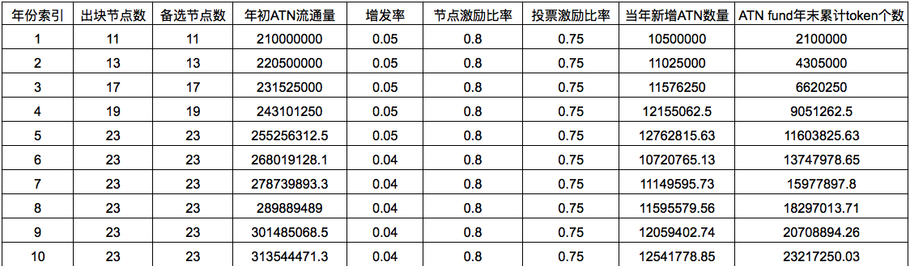

# ATN 技术白皮书
### 版本 0.3.3
## 摘要
区块链技术前景广阔的原因是目前非常多的行业存在垄断。人工智能就是这样一个领域，各大厂商相互割裂，基于目前人工智能的深度学习算法，每一个人工智能都是由大数据喂出来的一头怪兽，只有那些拥有大量数据的软件公司才能训练出更加强大的人工智能怪兽，因此，本来应该属于用户的数据却成为了互联网公司们争抢的最有价值的资源，但是因为每个公司的业务类型不同，拥有的数据也多种多样，所以每家公司即使再强大，也最多只能垄断一个领域的数据，而不能垄断所有的数据，因此每家公司陷入了尴尬的自给自足境地，因为无法也不愿意交换和共享自己最有价值的资源（也就是数据），导致各自陷入了孤岛和困境。

数据垄断带来的这些风险和问题，让区块链的去中心化有了用武之地，区块链最有价值的应用方法，就是协调各方面的问题：不同公司之间的协调，不同实体以及机构之间跨越疆界的协调，并以互信的方式进行充分互动，构建价值网络并相互交换价值，打破原先的垄断，在未来的人工智能网络中让不同的人工智能服务可以共建一个生态。

我们提出ATN的解决方案：一种去中心化的，无需授权的，用户自定义人工智能服务和使用接口的开放区块链平台。整体设计结合了Oracle，，以太坊等区块链项目的想法，侧重解决人工智能服务(AIaaS)与EVM兼容的智能合约之间互操作性的问题，未来计划利用下一代区块链技术为AIaaS搭建一个开放的经济系统，使得AI服务可以更多的交易和互操作，形成更强更丰富的人工智能。平台设计了AI服务接入方式，中间通过ATN智能合约进行连接并将接入的AI服务无需授权的提供给任何人，使得AI服务提供者和使用者都更加容易使用AI网络。

## 介绍
共享AI的第一步，是我们如何通过区块链建立一个将不同AI服务连接到一起的服务，以及如何搭建区块链智能合约世界和AI世界之间的桥梁，让用户获益。我们将介绍如何用DBot技术链下共识技术来让区块链的智能合约和AI服务互相操作，我们将首先在以太坊上实现一个Dapp来向以太坊网络上的合约开放这种能力。在这个阶段，还将提供一个ERC20的Token合约，提供代币作为使用这些AI服务的燃料(手续费)。ATN的第二步，就是搭建一条独立的基础链，并将代币互换服务、DBot平台等融合进一条独立的链中，利用侧链和分片技术与其他的网络进行交互并实现价值交换。代币合约将迁移至独立链中变成本地代币。

ATN可以解决智能合约中调用AI服务的问题。目前类似以太坊网络中的智能合约中的"智能"并不真正智能，"智能"的说法来自于"智能手机"，更倾向于自动化的意思，而ATN通过引入AI，可以让智能合约及区块链系统成为真正的"智能"。另外，由于目前类似以太坊网络中的这些Dapp生态，很多都是用智能合约实现并治理，当智能合约可以使用AI服务后，AI将会给智能合约赋能，并帮助类似Aragon这样的智能合约实现Dapp的人工智能治理。

ATN可以解决目前互相割裂的诸多AI服务之间相互调用的问题，因为ATN通过Dapp(或第二阶段的区块链系统)提供了一个去中心化的，无需授权，人人皆可访问的AI经济网络，解决AI参与方之间合作问题，ATN成为了AI生态的一个支付网络和具备智能合约能力的经济基础设施。

### 无需互信的AI互操作
与传统AI服务相比，系统更加易于实施。加入ATN网络非常简单：

- 基于ATN提供的API和Schema包装现有的人工智能服务
- 开发dbot的Oracle预言机程序，接入AI服务，并部署到ATN的多个预言机Relay服务器中.
- 开发调用AI服务的代理智能合约，定义价格和其他参数，并部署和注册到ATN的AI服务管理智能合约中。

ATN将对常规用户开放提供AI服务调用接口，对常规用户隐藏所有复杂的区块链技术，但对社区开源这些复杂的技术规范和实现。
### 统一的接口认证
ATN提供了一套统一的接口认证管理方式。当前所有的主要API服务提供者都可以按照这套统一的接口认证方式定义各自的访问控制和授权行为，例如对请求消息用<app_key, app_secret>进行签署授权。这种去中心化和无需许可的设计，为所有人提供了一个开放且安全的网络接入，并且解决了AI服务之间的复杂的合作和访问问题。ATN还将这种接口认证方式与支付通道技术相结合，在经济层面为API服务提供者和消费者提供了极大的便利。
###  开放平台
ATN是一个可通过智能合约扩展的开放平台，从而实现与其它基于以太坊的Dapps的交互和协作。 ATN的开源特性使得第三方开发人员能更好的在平台之上构建可交易应用程序。 该平台可以支持多种应用程序。

## 架构设计
### 总览
TBD
### ATN代币标准
ATN代币为ATN网络的主要代币。ATN代币可以作为用户使用ATN区块链网络和AI服务的费用和燃料，也可以作为DBot账户提供约定服务的激励报酬和AI服务提供商的收入。ATN代币是ATN网络的通用代币。

ATN代币的经济激励系统将会作为ATN去中心化自治系统的重要部分参与网络的升级和管理。同时，代币经济系统也会给AI和机器人带来更充分的经济独立 。

ATN代币最终将基于不同的网络标准实现对应的标准代币，以EVM兼容的智能合约平台为例，将会遵循以太坊上提出的ERC-20和ERC223两个标准。

ERC20 代币标准描述了以太坊代币合约必须实现和遵循的方法和事件，标准化有利于帮助不同的功能和组件共享基础设施。

与大部分代币合约只支持ERC20标准不同，ATN代币合约还会支持ERC223标准 ，这是因为ERC223将会解决ERC20的诸多问题并带来一些好处：
1.	当代币转账的接收方是合约账户时，ERC-20是无法实现对这个转账交易的回调处理的，因此无法实现类似本地代币ETH那样的fallback功能。ERC223使得代币可以像本地代币那样，除了用于代币转账，还可以用于与各种合约交互，包括用于代币分发合约。
2.	代币有可能会被用于发送至那些对ERC20代币并不友好的合约，因为这些合约缺乏对代币良好的接收处理，大量的代币可能会因为这个缺陷而丢失。
3.	当账户需要某个合约来花费他的ERC20代币余额时，这个账户必须先对这个合约进行额度授信操作(approve)，然后合约才可以调用转账操作(transferFrom)来进行花费，并且，这样需要产生两笔网络交易，消耗更多的手续费和时间。而ERC223可以将这两个交易和操作合二为一，大大简化了这种场景的流程。

虽然ERC223是一个还在修订中的标准，且目前大部分钱包和基础设置还没有完全支持ERC223，但是因为其给代币模型带来的诸多优点，随着时间的推进，会有越来越多的钱包和基础设施支持这个标准，目前雷电网络项目已经支持ERC223。

## 服务提供者和消费者的交互
### 人工智能和API市场
### 控制层
### 支付通道

## 经济和激励系统
DPOS共识算法需要一定数量的超级节点轮流出块，过多的超级节点会降低公链性能，而过少的超级节点容易引发中心化的诟病，因此我们提出可增长的超级节点序列的概念：为了鼓励社区早期支持者和保证公链的较高处理性能，在公链的初期限定较少的超级节点数目，以及相应较少的备选节点的数目；随着年份的递增，超级节点的数目也会依次递增，直到到达超级节点的上限，同时相应的备选节点的数目也会随之递增。

为了激励出块节点和保证ATN公链的活性，在经济上我们认为每年度适量的增发代币是一个较为合适的解决方案。同时，ATN公链将增发率限定在一个较低的水准，例如5%，来保证较低的通胀水准，同时在经过一定的年份后增发率也会随之降低。每年新增的ATN代币会按比例分配，包括以下三个部分：

- 出块节点的出块奖励：出块节点根据出块的工作量多少公平地获得每一个出块奖励。
- 出块节点/备选节点的存活奖励：任一周期内，出块/备选节点平均分配存活奖励。
- ATN Fund：直接从每年新增ATN token里按比例专门划拨。

其中，ATN Fund是一个完全由社区自治的基金会，其每年获得的新增ATN总量的20%收益, 且只能用于支持ATN和DBOT生态发展，例如对社区开发者提出的基于ATN生态的应用开发给予扶持。ATN Fund代币的使用完全由社区自主决定，例如通过投票等方式。
剩余的80%的新增代币，将在扣除需要分配给出块节点的出块奖励之后，被平均分配给作为维护ATN主链活性的支撑者，即所有的出块节点和备选节点。

### 代币激励计划 

我们根据出块节点数的动态增长，按照年份，给出详细分配计划节点年收入计划。需要注意的是，在第23年之后，后续的年份的激励计划中的“出块节点数”，“备选节点数”，“增发率”，“节点激励比率”以及“投票激励比率”均与第23年保持一致，由于篇幅原因，我们不给出第23年之后的具体的各项指标。

ATN代币激励计划

节点年收入计划

我们对其中的几项指标给出以下解释(注：以下指标的计算均不考虑出块节点的交易手续费收入)。

-- 节点年成本： 指成为出块节点/备选节点的最低硬件花费，不考虑硬件损耗和电费成本。

-- 增发率：在现有流通量基础上增加的ATN token数量的比例。

-- 节点激励比率：年新增ATN数量用于分配给出块节点的出块奖励，以及所有出块节点和备选节点的存活奖励的比例。

-- 投票激励比率：年新增ATN数量用于出块奖励和存活奖励时，存活奖励所占的比例。这里我们认为需要将大部分奖励分配给参选的节点，用来保证公链有足够的支撑点维持活性。

--  质押数量:成为出块节点或者备选节点需要质押一定数量的ATN token。

-- 出块节点的年入数量: 如果出块节点在一年内连续担任出块节点，则可获得的最大ATN token收入个数。

-- 备选节点的年入数量: 如果备选节点在一年内连续担任备选节点，则可获得的最大ATN token收入个数。

## 共识机制
ATN主链将采用优化后的代理权益证明共识机制保障区块链的正常运转。

## DPOS节点制衡

### 创世节点和计票安全

为了保证主链上线时的安全性，第一个周期的所有11个创世的出块节点将由ATN基金会官方部署。从第二个周期开始，出块节点和备选节点的选择由第一个周期的投票结果确定。同时，为了保证主链的安全性，ATN主链计票的“安全激活门限”为当前流通量的15%。如果链上记票时首次突破了此项门限，则ATN基金会将会撤回所部署的超级节点，由ATN社区进行完全地自主治理和维持主链运作。

### 累计投票机制

在优化后的DPOS共识算法里，参选节点k的周期n的被投票数v_{k,n}的计算，考虑了其历史表现，即用该周期内该节点获得的所有票数t_{k,n}，乘以该节点在最近的一个出块周期里的出块率。即:

k是节点的唯一身份标识信息，n是节点累计参与出块的周期数。s_{k,n}表示节点k在出块周期n的节点评分。未曾出块的节点被授予80的初始评分。

 p_{k,n}是节点k在出块周期n的出块比例乘以100，即:

- 周期n的出块节点集合的粗略定义如下，其中\delta是当前年份的超级节点个数。

 

注意，n=0为创世周期，此时的出块节点集合为一个例外，由ATN基金会部署的超级节点为该周期的出块节点集合。这与前文中的创世阶段设计保持一致。

- 参数\alpha反应了当前周期的出块表现在“出块评分”指标里所占第权重。我们推荐较大的\alpha值，主要考虑“出块评分”需要客观反应节点在较长时间内的出块水平。\alpha的推荐值为0.95。

- 参数\beta反应了在表现糟糕(p_{k,n}<60)的出块周期里, 需要被扣除的分数。\beta的推荐值为2.5。

### 质押机制

为了保证公链的稳定性，我们要求出块节点在参选之前必须质押一定数量的ATN token, 推荐值为10000个。需要强调的是，节点主动进行质押，则表示该节点愿意参选，自动进入全网的候选人列表。出块节点如果在一段时间内表现糟糕，例如长时间不出块，则其质押的ATN token将会被罚没并全部分配给ATN fund。我们根据实际运营情况和目前公链设计中的暂定运行参数，规定：

任意节点的质押代币被全部罚没的“节点评分”的门限值为S_{abandon} = 32。也就是说，任意节点的节点评分一旦低于该门限值，其质押的ATN token将被重新分配给ATN fund。我们具体分析被罚没的几种可能性。假设公链的出块速率为5秒出一个区块，且1000个区块为1个周期。

未曾担任出块节点的任意节点，如果连续担任出块节点且持续表现糟糕(p_{k,n} < S_ {low}= 60)，则他的节点评分会从80开始依次递减。第19个周期（约26小时23分钟之后）他的节点评分为80-19 \times 2.5 = 32.5, 第20个周期之后（约27小时47分钟之后）他的节点评分为30, 小于门限值32，将被罚没质押的代币。

如果出块节点当前的节点评分为接近100，意味着在之前的很长一段时间里，该节点出块表现持续优异。这样的节点需要被罚没质押的话，需要经历(100-32)/2.5=27.2个周期。所以，第28个周期（约38小时53分钟）之后，他的节点评分为30，将被罚没质押代币。

另一方面，ATN普通用户在进行投票时所使用的ATN token也会被质押。一旦用户撤回这些选票ATN token, 则他的这次投票选择将会被视为无效投票。

### 节点卸任

为了保证公链的稳定和各节点都有机会成为出块节点或者备选节点，我们引入节点卸任机制。任意节点在成为出块节点或者备选节点之后，在后续的任一周期里都有可能会主动或者被动地卸任。

- 主动卸任:出块节点或者备选节点可以在任意时刻选择撤回质押代币，这意味着它将不在选择担任公链的支撑节点。所退质押代币的数量r_{k}由以下公式获得, 其中s_k表示节点k的最新节点评分，D表示全部质押代币数量，推荐值为10000。

- 被动卸任：出块节点或者备选节点因为表现糟糕，导致其节点评分低于S_{abandon} = 32分，则它将被罚没所有质押代币, 即r_k = 0。如果该节点希望再次有机会成为备选节点或者出块节点，它需要重新进行质押，这意味着它再次进入候选人列表且被授予初始节点评分S_{initial}。

## DBOT开放平台
## AI数据计算开放平台
