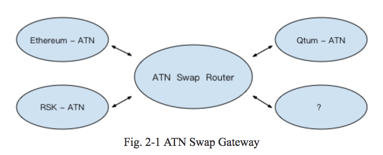
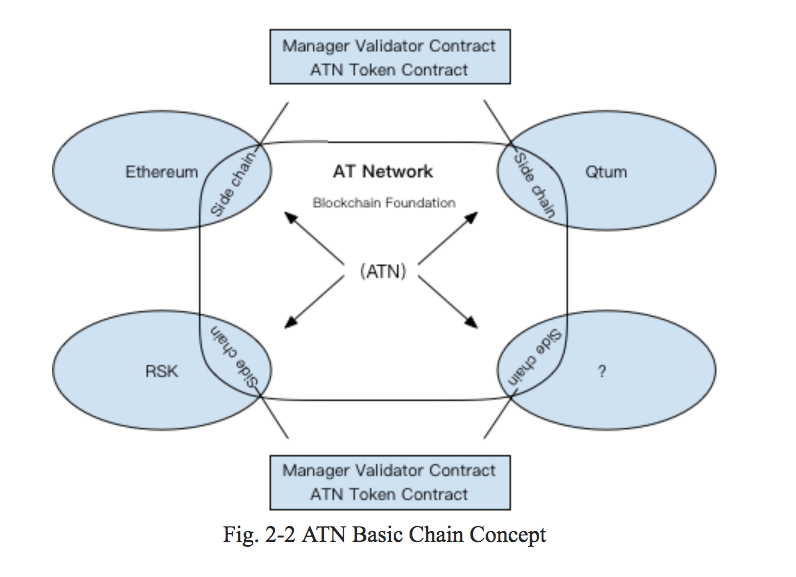
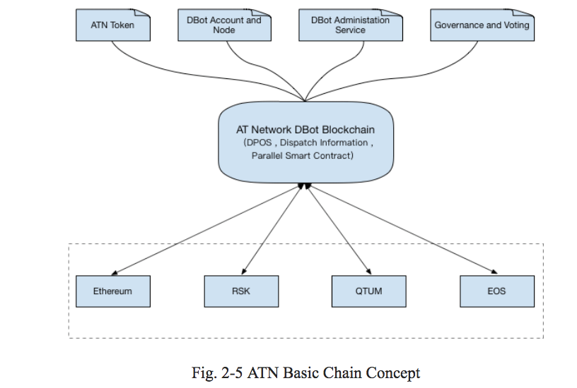

# ATN White Paper

### Leveraging blockchain to technology to provide a secure, trustful, and interoperable A.I. marketplace.

Version 0.3.3

ATN.IO

## Abstract

One of the key attributes of blockchain is the decentralized nature of the technology. This characteristic provides the ability to set up decentralized networks to overcome the challenges of highly centralized (i.e. monopolized) industries such as the nascent Artificial Intelligence (A.I.) industry where major players tend to isolate themselves from the competition in an attempt to secure their competitive advantage through technology development and access to big data. Success breeds success and each large A.I. player is increasingly capturing significant amounts of big data to further cement their competitive advantage. 

In light of this, data has become the Internet’s most valuable resource.

However, because each company has different types of businesses and data, they can only improve their AI according to the data they own. As a result, every company faces an internal conflict, as they need additional data to grow, but are not willing to share their own resources (data) in exchange, resulting in a slowed and fragmented industry.

To improve the AI industry, we propose to leverage the decentralized nature of blockchain in order to address the root of the problem by creating an environment to encourage cooperation between companies, entities, and institutions across the borders, in a fully trusted manner. 

Introducing ATN: an AI Marketplace where developers, technology suppliers and buyers come together to access and develop new and innovative forms of AI technology, thus creating the next generation of artificial intelligence in a trusted and collaborative environment. 

ATN is a decentralized, permission-less, customizable AI service and open interface blockchain platform. The overall design combines the ideas of oracles and other cross-chain projects. Focusing on solving the interoperability issues between Artificial Intelligence as a Service (AIaaS) and EVM-compliant smart contracts. 

ATN will develop next generation blockchain technology for AI-aaS to build an open economic system, enabling easier transactions and interoperability between AI services, resulting in the formation of a more robust artificial intelligence industry. The ATN platform design allows AI services to be accessed through ATN smart contracts, without requiring authorization, thus allowing users to easily interact with AI service providers. 

## Introduction

ATN is an Artificial Intelligence AIaaS marketplace where developers, technology suppliers and buyers come together to access and develop new and innovative forms of A.I. technology effectively building the next generation of artificial intelligence in a trusted and collaborative environment.

ATN is built on a smart-contract enabled next-generation blockchain that gives DApps quick and secure access to AI capabilities and service through a DBot/DApp ecosystem that will be created by ATN.
With blockchain technology, ATN uses encryption to protect data sets and A.I. algorithms, to allow for rapid commercialization and adoption. This will reduce the barrier to entry for companies who want to use A.I. solutions cost effectively. Developers will be able to share their work in the marketplace with the knowledge that their technology is secured and that they will be remunerated for their work.
ATN manages, promotes and fosters technology co-creation and collaboration to help the A.I. industry improve development efficiency and incentives to drive adoption across industry verticals. 

### Connecting Blockchain and A.I. 

The first step in developing the ATN platform is to build a blockchain service that connects different AI services together to create a blockchain smart contract ecosystem for the benefit of users. We'll introduce the Dbot technology to provide interoperability between blockchain smart contracts and AI services. 

ATN will implement a DApp in the Ethereum testnet to enable this capability on the Ethereum network. At this stage, an ERC-20 token contract will also be provided and tokens will be used as “gas” for the use of these AI services (handling fees).ATN’s second step will be the creation of an independant ATN blockchain with a native token which will be interoperable with other blockchains to enable an ecosystem of interoperable smart contracts to access AI services through ATN’s DBot platform. 

### Smart Contracts

ATN can solve the problem of invoking AI services in smart contracts. Currently, smart contracts on the the Ethereum network are not really "smart". The “smart” in this context refer more to the automation aspect rather than on a genuine intelligence. 
The introduction of AI in ATN will make the blockchain services to become truly smart.

In the current Ethereum network ecosystem, most Dapp governance are implemented using smart contracts. After introducing AI to smart contracts, ATN will create a “genuine” intelligence which will be able to to take smart and appropriate decisions based on data and AI algorithms. To take a concrete example, a Project like Aragon will be able to achieve AI governance.

ATN can also solve the problem of integration between fragmented AI services. ATN through DApps will provide a decentralized and permissionless AI economic network accessible to everyone, solving the problem of cooperation between AI participants. ATN provides an AI ecosystem with a payment network and smart contracts that create an economic infrastructure.

### Trustless and Interoperable AI

Joining ATN is simpler than joining  traditional AI services:
*ATN provide API and Schema package of all existing AI services.
*Implement the Dbot Oracle Predictive Machine, connect it to the AI services and deploy to ATN’s distributed relay server
*Develop smart contracts that call AI services, define the pricing strategy and other parameters, deploy and register on ATN AI service management smart contract.

### Open platform

ATN is an open platform, which can be extended through intelligent contracts to enable interaction and collaboration with other Ethereum Dapps. The open-source nature of the ATN allows third-party developers to build applications that can connect and exchange with the services of the network.

## Detailed proposal

### Cross-blockchain ATN token 

#### ATN token

ATN tokens are the main token of the ATN platform. ATN tokens can be used to pay for fees and “gas” by users to access AI services, or can be a reward for a Dbot user account which provides an AI service. 

The purpose of ATN is to become a DAO where ATN tokens will be used for the governance system.

We will support ERC-20 and ERC-223 standards of the EVM-compatible smart contract ethereum platform.

The ERC-20 Token Standard describes methods and events that Ethereum tokens must implement and follow. The majority of token contracts only support the ERC-20 standard but ATN will also support ERC-223 standard as it overcomes some of the shortcomings in the ERC-20 standard and also bring some additional benefits.

#### Cross-blockchain token support

Unlike normal tokens, ATN tokens are designed to be cross-blockchain tokens which means that ATN tokens can be used and exchanged other blockchains such as Ethereum, Qtum, RSK, etc..

In order to enable ATN tokens to be used on different blockchains, in the first stage of the project, we will introduce the ATN Swap Router.  This is a centralised service that will help with token circulation between the different blockchains.

At a later stage we will introduce a side-chain or a cross-chain protocol and the swap router will become part of the ATN infrastructure. With the help of the side chain and sharding technology, we will implement atomic cross blockchain operation. 

Even if different blockchains can possess ATN tokens, the overall total number of tokens will be constant. This mechanism will be ensured by the Swap Router technology in the project’s first phase and will then be a native cross blockchain feature in subsequent phases.

### Cross blockchain and cross-DApp platform

In order to use AI services on different blockchains, ATN will implement a DApp in the Ethereum environment and subsequently DApps in other smart contract environments such as Qtum, RSK, etc...  Different DApps in different blockchains will need to support ATN’s base blockchain interoperable smart contracts.

An ATN DApp contract should have these properties:
*A token contract
*An authorisation account manager which contains information on the AI service side account, the DBot account, consumer accounts and user authentication modules that access third party contracts (such as uport)
*An AI registration service manager used to register the AI service, which contains information on the AI service registered, inquiries, the price of the service, information regarding the availability of the service and the way it expects to communicate. This can also include additional details such as the use of special communication channel (e.g. the lightning network)
*A DBot proxy contract which is in charge of communicating with outside services and which is responsible to execute callbacks after receiving results from external services. This includes oracle implementation, DBot account management, off-chain consensus algorithms and  return of  AI service results back to the DApp.
*DApp autonomy and renewal management contracts which include upgrading the relevant contracts and separation of the contractual logic and the data.

### DBot platform

*Off-chain consensus operation
*Open source DBot server, provide DBot account maintenance operations
*Provide tools for DBot account registration and AI services
*Open AI market and user interface to access AI services
*AI deep learning algorithm, and computing power.

#### Communication pattern between a smart contract and a DBot

The blockchain execution of smart contract is deterministic, which means that if you execute a smart contract with the same parameters, it will always return the same answer and then it will update the blockchain records. That’s why we cannot directly query or call external services or any kind of Internet resources if they can introduce non-deterministic behavior. 

The introduction of DBot will solve this issue. Communication between smart contracts and DBots are asynchronous. When a smart contract wants to access an AI service, it will trigger an event.  The DBot node will receive it and communicate with the AI service according to the parameters and the strategy chosen in the smart contract.  Then it will receive the result and send it back to the blockchain smart-contract. 

Here the DBot can be a trusted third party or can be an ATN DBot service selected through the governance group mechanism. The DApp ensures the DBot data reliability through an economical reward mechanism. This mechanism includes the following steps:
*Creation of an AI registration service manager contract which contains information such as the corresponding DBot account administration strategy. This DBot account is responsible for defining the communication protocol between the AI services and the DBot worker.
*A free inquiry about the AI service.
*A consensus strategy to return more accurate and reliable deterministic data.
*The AI registry service contract forwards the AI result to the caller contract.
*The caller contract can execute its callback. 
*During all the preceding steps, the AI registry service contract is responsible for collecting the fees to use of the AI services. It will reward the DBot account regarding their registered information.

### ATN Basic Blockchain Architecture

#### Basic chain

*The DBot blockchain supports EVM compatible smart contracts
*Improvement of DPOS consensus algorithm
*Improved fee model by using EOS’s  bandwidth control mechanism
*Implement: Graphene (or EOS) + EVM
*Create sharding inspired by Ethereum 2.0 and EOS, parallel smart contract, dispatch information design, every group of AI services install corresponding sharding area. Every Dbot services group will resolve off-chain until they find a consensus.
*ATN tokens migrate to the DBot blockchain as the native token
*Dbot account moves to the Dbot blockchain
*DBot administration service contract moves to DBot blockchain contract
*In order to provide EVM compatible smart contract interoperability, we provide blockchain smart contract interoperability platform:
**RSK interoperability contract
**Qtum interoperability contract
**EOS interoperability contract
*Governance: built-in system integrating AI voting proxy

