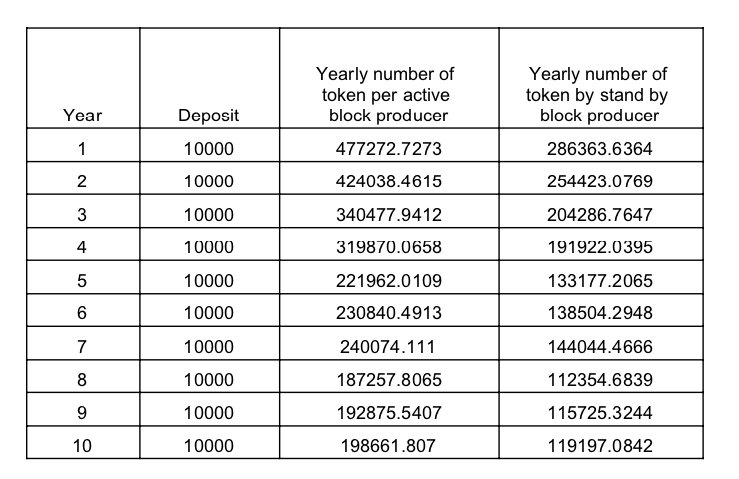

# ATN White Paper

### Leveraging blockchain to technology to provide a secure, trustful, and interoperable A.I. marketplace.

Version 0.3.3

ATN.IO

## Abstract

One of the key attributes of blockchain is the decentralized nature of the technology. This characteristic provides the ability to set up decentralized networks to overcome the challenges of highly centralized (i.e. monopolized) industries such as the nascent Artificial Intelligence (A.I.) industry where major players tend to isolate themselves from the competition in an attempt to secure their competitive advantage through technology development and access to big data. Success breeds success and each large A.I. player is increasingly capturing significant amounts of big data to further cement their competitive advantage. 

In light of this, data has become the Internet’s most valuable resource.

However, because each company has different types of businesses and data, they can only improve their AI according to the data they own. As a result, every company faces an internal conflict, as they need additional data to grow, but are not willing to share their own resources (data) in exchange, resulting in a slowed and fragmented industry.

To improve the AI industry, we propose to leverage the decentralized nature of blockchain in order to address the root of the problem by creating an environment to encourage cooperation between companies, entities, and institutions across the borders, in a fully trusted manner. 

Introducing ATN: an AI Marketplace where developers, technology suppliers and buyers come together to access and develop new and innovative forms of AI technology, thus creating the next generation of artificial intelligence in a trusted and collaborative environment. 

ATN will develop next generation blockchain technology for AI-aaS to build an open economic system, enabling easier transactions and interoperability between AI services, resulting in the formation of a more robust artificial intelligence industry. 

## Introduction

ATN is an Artificial Intelligence AIaaS marketplace where developers, technology suppliers and buyers come together to access and develop new and innovative forms of A.I. technology effectively building the next generation of artificial intelligence in a trusted and collaborative environment.

<!-- ATN is built on a smart-contract enabled next-generation blockchain that gives DApps quick and secure access to AI capabilities and service through a DBot/DApp ecosystem that will be created by ATN. -->
With blockchain technology, ATN uses encryption to protect data sets and A.I. algorithms, to allow for rapid commercialization and adoption. This will reduce the barrier to entry for companies who want to use A.I. solutions cost effectively. Developers will be able to share their work in the marketplace with the knowledge that their technology is secured and that they will be remunerated for their work.
ATN manages, promotes and fosters technology co-creation and collaboration to help the A.I. industry improve development efficiency and incentives to drive adoption across industry verticals. 

### Connecting Blockchain and A.I. 

#### Open platform

ATN is an open and open-source platform that allows third-party developers to build applications that can connect and exchange with the services of the network.

The first step in developing the ATN platform is to build a blockchain service that connects different AI services together to create a blockchain smart contract ecosystem for the benefit of users. We'll introduce the Dbot technology to provide quick access to AI services.

The DBot technology is the first step to connect AI providers to AI consumers. You can find a video of our current progress [here](https://www.youtube.com/watch?v=rj1Rvjr4kxA) and test it out.

### Universal account

Currently all major API service providers need access authorization, for example by signing requests using <app_key, app_secret>, where <app_key, app_secret> are usually provided by the API service provider.  

ATN provides a unified API service authorization management solution. Its decentralized and permissionless design provide a network accessible to everyone, solving the problem of complex access and facilitate cooperation between AI services. ATN provides this ecosystem with an almost instant and without fees payment network (payment channel) that create an economic layer which will benefit providers and users.

### Trustless and Interoperable AI

ATN ecosystem has been designed to be very simple to use and to give provider as much freedom as they want. It's an attempt to reduce the gap between providers and consumers. Joining ATN is simpler than joining  traditional AI services:
* ATN provide API and Schema package of all existing AI services.
* Auto implement an authorization and payment system for all API providers.
* Have access a world-wide user base.

## ATN Ecosystem Architecture

### Ecosystem overview

* API, data and computing power marketplaces
* Rich developper ecosystem with different kind of Dbots.
* Developper ecosystem with libraries to access ATN services.
* The ATN chain supports EVM  smart contracts.

### ATN token

ATN tokens are the main token of the ATN platform. ATN tokens can be used to pay for fees and “gas” by users to access AI services, or can be a reward for a block producer.

An amount of ATN tokens needs to be frozen in order to deploy a block producer. This is a protection mechanism in order to make potential network attacks and bad block producer behavior expensive.

ATN token will also be used to elect block producers.

The purpose of ATN is to become a DAO where ATN tokens will be used for the governance system.

We will support ERC-20 and ERC-223 standards of the EVM-compatible smart contract ethereum platform which will allow service providers to deploy their own means of exchange in ATN ecosystem.

More details can be found in the economic part of this paper.

### Consumers and providers interaction.

#### AI and API marketplace

The AI marketplace is an user interface where consumers can see a vast range of services. You can test our current alpha demo [here](https://market-test.atnio.net/) and watch a demo video [here](https://www.youtube.com/watch?v=gsxSz9jfMd8)

The API market is an opensource project. It will automatically generate the API description page for all the registered API Dbot in the market.
Since it's an open source project, anybody can decide to deploy a market, it will be possible to deploy an open market (anybody can access it) or a close market (you will need to be whitelisted in order to use services)

#### Control level

We can define **public versus private services** as following:
**A public service** is a service registered in a public registry thus knowable by anybody.
**A private service** is a service which is not a public service.

We can define **open service** and **permissioned service** as following:
**An open service** is a service where consumers don't need to be whitelisted in order to be accessed.
**A permissioned service** is a service where consumers need to be whitelisted in order to use it.

A service can support **native ATN** payment or **customized payment**, customized in this context means that the provider will support his own mean of payment in the ecosystem by accepting  another token supported in ATN ecosystem. This token can be deployed by the provider.

The combination of these different level of control give an huge freedom to providers and consumers in the way they want to use ATN ecosystem. It can range from public market of open services to  private market with permissioned services with customized payment.

#### Payment channel

Some AI services  will be called often and thus require significant amount of communication. With a very naive design we would have to charge each time the service is called by doing a transaction which will result in significant transaction fees and which will be very slow (compare to traditional centralized system). That's why ATN uses a high-frequency micro-payment technology, **the payment channel**, put it at the core of it's design and believe that the majority of transactions between consumers and providers will be done through it. You can see below the sequence diagram to use such a payment channel. We will provide more technical resources regarding payment channel which will be in our other open-source repositories. We decided to put that one here following the language-idiom "A picture is worth a thousand words". We believe it can help newcomers to have a better understanding on how it works in pratice.

<!--  -->

##### Estabishing payment channel sequence diagram.

Once the payment channel is establish. The interaction between providers and consumers is as fast as a centralized system.
It also offer a pay-per-call design which is a great way of charging a product for a provider.
Proofs of payment will be onchain to add more transparency.

#### Dbot server technology.

The Dbot server is a key component of ATN ecosystem. You can find a detailed documentation [here](https://github.com/ATNIO/dbot-server)

### Economy and incentive of ATN chain

The economy of a blockchain is a key aspect because it has to be economically profitable to the different actors to participate and maintain the network.
The safety of a decentralized ledger is also a crucial property because it brings the value of the network. That's why people will trust it and use it. 

Its with all these considerations that we introduce this economic plan in order to protect and develop ATN ecosystem. ATN public chain has a DPOS consensus with dynamic number of block producers. 
At the beginning there will be few block producers and it will slowly increase over time **until we reach 101 nodes.** 
That way we can guarantee the liveliness and the security of ATN chain whilst ensuring a good incentive for block producers.

As all other public chain, ATN will use inflation in order to maintain the network. The inflation during the first five years will be **5% and will slowly decrease to 3%.** 
This inflation will be separated into 3 categories:
1. 80% to the block producers with:
	1. 75% **equally distributed to the top actives and standby** block-producers with the highest voting rate. ( It will cover the cost of the server)
	2. 25% for active block producers as **block rewards**.
2. 20% to the ATN fund.

**ATN fund** will be used to finance projects which will be beneficial to ATN ecosystem. Anybody can be a candidate to such a project.

#### Block producer incentive

In a real world, not every person is driven with good intention. In human nature we can find the best and the worst. That’s why in order to protect the network and punish harmful behavior we designed some “commitment rules” which will make an attacker think twice before attempting of doing one . Any network is attackable and the only thing we can do is to make it as hard and as costly as possible.
It will be required to deposit 10,000 ATN to be a candidate to be a block producer.

The table 2 show the reward for block producers over the years as number of block producers increase. It only show the economic incentive due to the inflation but it’s important to keep in mind that when a block producer create a block, it will receive the **transaction fees** as well.

Block producer incentive summary:
1. Equally shared reward for the top voted block producers.
2. Block creation rewards.
3. Fees following the pay-your-bid system of the transactions included in the block.

#### Block producer scoring system.

No single point of failure, liveliness and protection of the network are some big responsibilities given to block producers. 
Block producers are voted by the community therefore it’s important for the community to have useful data that can help to select good ones. That’s why we need a **scoring system** that can help the community to choose block producers thus maintain the system healthy. 

Additionally we will introduce some **automatic protection mechanism** based on the block producer score..

**Each block producer** will be affected with a score.
The score is computed in an iterative fashion according to **round n**.
**A round** is a period defined by a set of **active block producers** which are responsible for **the next 1000 blocks of the chain**. 
The total score of a node depends on its previous score and its recent performance during the last round.

Definition of the performance for a round.

##### Selection of active block producers:

Each round there are two very important parameters for the selection of active block producers:
1. The voting percentage of node k.  (number of votes received by the node)
2. The performance of the node k during the last round.

We introduce a non-formal definition of **function top** to help the audience to understand the concept without introducing too complex definition.
**Function top**  takes 3 parameters, a list myList, an element myElement and a number of element numberOfElements and return true if myElement in myList belong to the top numberOfElements of the list.

Using function **top** allows us to simply define the set of active block producers at any round.

Definition of the total score of a node:

* Below a certain threshold for the score of a block producer set to  Smin=32, the deposit of the block producer will be taken and given to the ATN fund.
* In real world, a server cannot be 100% stable and failure can happen. That’s with these considerations that we selected the parameter =2.5. It should prevent a new block producer ( starting with a score of 80) to have a failure or a big instability for 48 h before crossing Sthreshold . 
* The parameter  is a consequences of the parameter  to keep the continuity between the two set of rules.
* As a result, =0.95

#### Getting back deposit and penalty

At any moment, a node can get back his deposit following this simple rule:

#### Server requirements

Technical specifications of ATN block producers server:
* 8 CPU
* 16GB of memory
* 4 TB of storage
* A bandwidth of 20Mb/s

#### Voting mechanism and mainnet launch.

Each time you vote you reserve ATN tokens for voting and as long as your vote is active, your token are **“staked”**.
You can decide to **unstake your token at any moment** and you will get them back.

In order to protect the network, ATN voting percentage will need to reach a minimum of 15% of the current circulating supply.
If this condition is not fulfilled, ATN foundation will be responsible for at least ⅔ of the block producers.
**After the minimum of 15% of voting is reached**, it will become a traditional voting selection for block producers with no possibility to come back to the initial state, even if the voting percentage shrink below 15%.

### DBot open platform

* Open source DBot server, easy to configure and deploy, admin panel with metrics, access control system, logging system, support replicates.
* Support REST API
* Provide tools for DBot account registration and AI services
* Open AI market entry and user interface to access AI services
* AI deep learning algorithm, and computing power access.

<!--  -->

<!-- #### Oracle Dbot

The blockchain execution of smart contract is deterministic, which means that if you execute a smart contract with the same parameters, it will always return the same answer and then it will update the blockchain records. That’s why we cannot directly query or call external services or any kind of Internet resources if they can introduce non-deterministic behavior. 

The introduction of DBot will solve this issue. Communication between smart contracts and DBots are asynchronous. When a smart contract wants to access an AI service, it will trigger an event.  The DBot node will receive it and communicate with the AI service according to the parameters and the strategy chosen in the smart contract.  Then it will receive the result and send it back to the blockchain smart-contract. 

Here the DBot can be a trusted third party or can be an ATN DBot service selected through the governance group mechanism. The DApp ensures the DBot data reliability through an economical reward mechanism. This mechanism includes the following steps:
*  Creation of an AI registration service manager contract which contains information such as the corresponding DBot account administration strategy. This DBot account is responsible for defining the communication protocol between the AI services and the DBot worker.
* A free inquiry about the AI service.
* A consensus strategy to return more accurate and reliable deterministic data.
* The AI registry service contract forwards the AI result to the caller contract.
* The caller contract can execute its callback. 
* During all the preceding steps, the AI registry service contract is responsible for collecting the fees to use of the AI services. It will reward the DBot account regarding their registered information.

 -->

### AI Data Computation Open Platform

#### Necessity of AI resources collaboration

The victory of Alpha Go over the world famous chess player Lee in 2016, was a very memorable step in the history and progress of Artificial Intelligence. The reasons why Alpha Go could beat a human were not because Alpha Go had better logic or any special features that are better than the human brain but was mainly because Alpha Go had massive data training, using parallel algorithms involving significant computational power. In order to train Alpha Go, Google used data from hundreds of thousands of games of Go, and through a reinforcement learning technique Alpha Go became better and better each time.

From the example of Alpha Go, we can see that the key elements to build good AI are data, algorithms and computational power. Unfortunately, these three elements require huge investment and that’s why it’s very hard for small companies or individuals to get results. 

In order to improve, AI algorithms need a lot of research, which is the strength of universities and AI technology innovation enterprises. Whereas the data and computing power are often in the hands of governments, cloud centers and big companies. 

Since ATN will be providing these three keys elements: research, data and computing power, it will bring significant innovation to the AI industry. While providing an economic benefit for AI resource providers, it gives an easy innovative platform for AI startups, which is a "win-win" situation.

#### AI Sharing Data Program

Unauthorized sharing of personal data and the infringement of data copyrights are the biggest factors that influence the willingness to share data. With blockchain technology and secure encryption, ATN can protect the rights of data owners and eliminate the risks of data sharing.

##### Personal Privacy Protection

Legal authorities and data owners all have a desire to protect personal privacy. Personal privacy protection is primarily to prevent the disclosure of information about a particular individual. AI algorithms can be modeled on a macro scale and do not need to know which datasets belong to which user. Therefore, personal privacy protection and AI modeling are not contradictory.

After the private personal information in the data is deleted or securely encrypted, the statistical characteristics (e.g. count, sum) of the data remain unchanged and personal privacy is protected.

###### Hashing

Using SHA256 and other hashing algorithms to encrypt the fields of user information, such as user ID, mobile phone number, age and so on, can protect the anonymity of personal information to a certain extent.

###### Differential privacy protection

The differential privacy protection in databases, sometimes associated with cryptography, is a property of anonymisation that can be reached via different mechanisms. It aims to define a form of protection for the results of queries made to a database by minimizing the risks of identifying the entities it contains, if possible by maximizing the relevance of the results of the query.

###### Secure Multi-Party Computation

Secure multi-party computation (MPC) is a branch of cryptography with the goal of creating methods that will be solved with the cooperation of a group of parties without having to trust each other.  Each party input given to the functions are private and doesn’t need to be shared with other parties.  This method ensure independence of input and correctness of the result.

To illustrate the process of secure multi-party computation, we can give a couple of concrete examples:

1. Alice suspects that she could have a genetic disease and want to get a diagnosis. She knows that Bob has a DNA database which can help her if she sends a DNA sample to Bob. But Alice doesn’t want others to know it and would like to keep everything secret. She cannot send the DNA sample directly to Bob otherwise Bob will have her DNA sample plus her personal information.

2. After costly market research, Company A decides to expand to a new market, expecting a strong return on investment. At the same time company A noticed that company B is also expanding to the same markets. Strategically, both companies do not want to compete with each other in the same area, so they all want to know if there is overlap in their market areas without revealing market location information as leakage of any information could result in significant loss for the company. For example, if another rival firm knows about the expansion of A and B companies, it could take early action to capture the market. 
3. Two financial organizations want to collaborate on a project to find a win-win solution. In order to cooperate, each organization has needs from the cooperation to be satisfied including the fact that they do not want to share their proprietary data between themselves or to any “trusted” third parties. How can they cooperate with this data privacy constraint?

###### Oblivious transfer protocol

Oblivious Transfer Protocol is the basis of secure multi-party computation. During a traditional information query, Alice sends a request to Bob and Bob returns the appropriate information to Alice. In this process, Bob is aware of Alice’s data request. In Oblivious Transfer Protocol, Bob does not know Alice’s data request, and Alice only gets the data she requested.

###### Homomorphic encryption

In cryptography, a homomorphic encryption is an encryption that has certain algebraic characteristics such as the decryption of a result of a mathematical operation on encrypted data gives the same result as it would on unencrypted data; this property makes it possible to entrust an external agent to perform calculations, without the data or the results being accessible to this agent.

#### AI computing power sharing

##### Centralized power sharing

Supercomputing Centers and Cloud Enterprises often have important but unused compute power, which can be shared as a service.  Compute sharing is mainly used in the AI model training stage which requires large computational power, and the model prediction stage can use a cloud platform directly.

The model-training platform should be built and support the following AI models:
* Stand-alone AI model: Python scikit-learn, Java weka, etc.
* Distributed AI model:  Spark ml-lib, MPI.
* Deep learning AI model: Tensorflow, Caffle, MxNet.

ATN provides an SDK for AI compute power sharing. One for the computing power providers to make it accessible to the users and another one for AI startups to be able to call the compute power provider services. The SDK mainly includes the following interfaces:
* Data upload interface: Upload encrypted training data,
* Model Training Interface: model training initialization,
* Model Evaluation and Export interface: model evaluation and export.

##### Crowdsourcing Power

There are many AI models with distributed learning structures. In these models, the work will be sent to participating nodes with a chunk of data and the result will be aggregated in aggregation nodes. For example, the ensemble learning models (GBDT/RF) are constructed by the union of individual trees; another example is the structure of neural networks which is built by a kind of assembled block pattern.

In the case of the Crowdsourcing Power Sharing, ATN will maintain some nodes that are used as AI Model Aggregation Nodes. Every crowdsourcing node of ATN will receive a small batch of encrypted training data and test data, and the node will use training data set to build an independent model, such as a small tree or neural network. The node will then use test data sets in order to classify the independent trained model and classification results will be sent to the Model Aggregation Node. The aggregation node compares the classification results received by the crowdsourcing nodes to ensure whether the node really trained the model or not.

#### Model sharing program

##### Pre-training Model Sharing

The deep learning models today are getting more and more layers. For example, in the ImageNet challenge, different models compete with each other, the 8 layer AlexNet, the 16 layer VGG, the 22 layer GoogLeNet and the 152 layers ResNet. Because neural networks have a very strong generalization ability, the deeper the model is, the better it can express the characteristics of the training data thus achieve a better classification effect.

The deeper a neural network model is, the longer the training time will be. The training time often last several weeks. In addition, deep neural networks need a huge set of training data in order to be trained well. 

‘Transferred learning’ may be a great help in order to facilitate the neural network’s training.  This idea is that the creator of deep neural network models pre-trains the model with large-scale datasets and publishes it, then users can use their own data to train the upper layers of the neural network model and will achieve a very good classification.

ATN will provide an SDK for creators to publish and protect the pre-trained models, and also for users to use the pre-trained models.

##### Parameterized Model Services

In order to use parameterized model services, users first need to upload a set of data. For example, for face recognition, users should upload the targeted face image to initialize it and then call the face recognition services.

##### Related work:  The zero-knowledge proof

The “zero-knowledge proof, from S.Goldwasser, S.Micali and C.Rackoff is a document written in 1980. It means that the prover can convince the verifier that a certain assertion is correct without providing the verifier any useful information. Zero-knowledge proof is essentially an agreement involving two or more parties, and a series of steps that are required to be done by the parties. The prover will convince the verifier without leaking any information. The zero-knowledge proof is a very useful cryptographic tools and is the perfect tool to protect data sovereignty and privacy.

## Actors

##### API service providers

Using ATN will allow API  provider to sell any kind of API with an optimized design. We particulary emphasis on AI services to make them accessible to a large user base.

##### AI Consumers

ATN makes it easy for any developer to create a browser for ATN using the Dapp metadata. This browser can list all the available services offered by the network such as list the AI services to make it easy for AI consumers to use the AI services. The AI consumer could be a smart contract, another AI service or an application. Access to all services require the use of ATN tokens. Payment for the service is held in escrow and the reward is processed by the ATN network once the API is used..

##### DBot Server

DBot server are responsible for the execution of the DBot services and  participate in off-chain AI services. This is the based piece of technology which connect the AI world to the blockchain.
[check documentation here](https://github.com/ATNIO/dbot-server)

##### AI and API marketplace

The AI marketplace is an user interface where consumers can see a vast range of services. 

###### API market features:

* open source
* can be public or private
* automatic generation of API documentation (according to open API standard)
* Admin metrics
* will support multilanguage API documentation generation

You can test our current alpha demo [here](https://market-test.atnio.net/) or watch a demo video [here](https://www.youtube.com/watch?v=gsxSz9jfMd8)

##### ATN explorer

This is an image of the current explorer on ATN testnet

###### Explorer features:

* will show the list of block producer with their current voting percentage.
* open source
* provide all basic features an explorer

You can test our open source explorer [here](https://explorer-test.atnio.net/) or watch a demo video [here](https://www.youtube.com/watch?v=l052DZcWkzk)

##### ATN wallet

Download and install our latest wallet [here](https://github.com/ATNIO/atn-wallet) or watch a demo video [here](https://www.youtube.com/watch?v=he7evu28Djw)

##### ATN Client Library

In order to interact with our ecosystem and access all kind of API in a convenient way, we provide a library. You can find our github [here](https://github.com/ATNIO/pyatn-client) and watch a demo video [here](https://www.youtube.com/watch?v=--iwBbZUEmA)

<!-- ## User case

In this section we will show some typical user case scenarios. This is just the tip of the iceberg but they are good illustrations of the potential of the ATN to improve the AI industry.

### AI services cooperation

Currently most AI services are separated from each other. ATN strongly believe that the AI cooperation is one of the most important feature in the future.  ATN is designed to facilitate AI cooperation.

ATN will  help users to perform complex AI tasks at very competitive prices. This new ecosystem will be beneficial for the AI world and for AI users, making AI easily available and affordable. --> 

## Summary

Unlike traditional AI systems with built-in limitations, centralized control, hard AI services cooperation, uncompetitive prices and fragmented AI services; ATN  provide a complete ecosystem build on a decentralized architecture, with autonomous and open source market, competitive prices and unified API calling services which is a huge improvement. It will help to develop smarter applications that will bring benefits to society as a whole. By encouraging the use of AI in our daily life we will be able to make better decisions and improve our lives.

## References
1. XiaoI：http://www.xiaoi.com 
2. Ethereum. Why should we use hybrid POW+POS mechanism？ http://www.8btc.com/powpos-vitalik-burterin
3. Oraclize: http://oraclize.it/
4. Neo whitepaper：http://docs.neo.org/en-us/
5. EOS Technical White Paper：https://github.com/EOSIO/Documentation/blob/master/TechnicalWhitePaper.md
6. Aragon White Paper: https://raw.githubusercontent.com/aragon/whitepaper/master/Aragon%20Whitepaper.pdf
7. Artificial intelligence algorithm platform https://algorithmia.com/
8. Ethereum Sharding： https://github.com/ethereum/wiki/wiki/Sharding-FAQ
9. Comit Network： http://www.comit.network/doc/COMIT%20white%20paper%20v1.0.2.pdf
10. Raiden Network：http://raiden.network/
11. Raiden Network POC：https://github.com/raiden-network/raiden/wiki/Raiden-PoC%E2%80%900
12. Understanding Oracle：https://blog.oraclize.it/understanding-oracles-99055c9c9f7b
13. Schelling Coin : https://blog.ethereum.org/2014/03/28/schellingcoin-a-minimal-trust-universal-data-feed/

